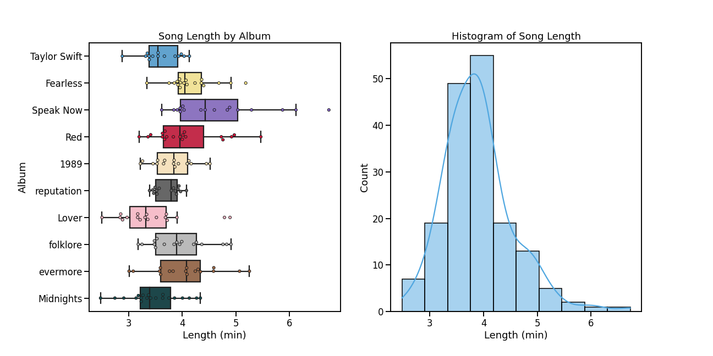
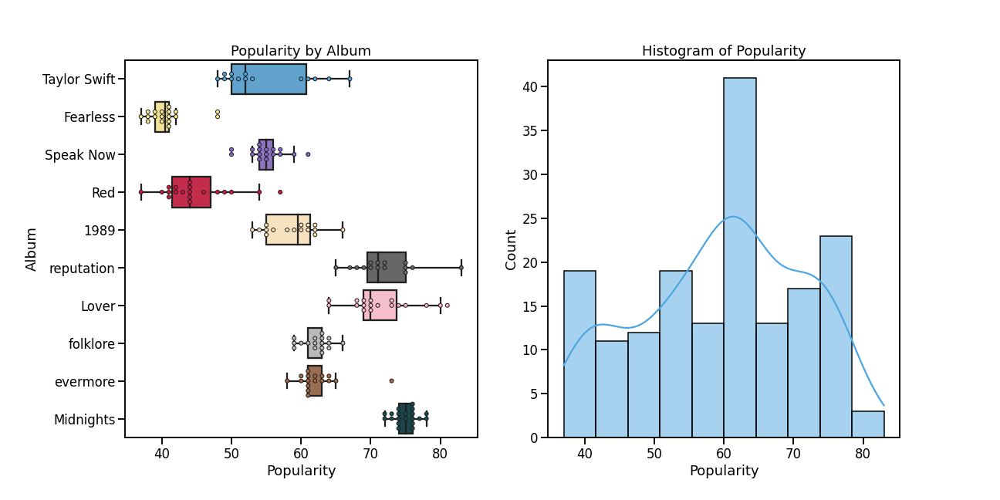
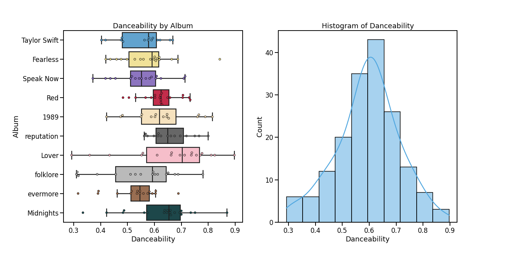

## Comparing Spotify Features of Taylor Swift's Albums

**Project description:** In this project, I will be comparing the 12 Spotify features of Taylor Swift's 9 studio albums. 

Her 9 studio albums are:

1. Taylor Swift (Oct. 2006)
2. Fearless (Nov. 2008)
3. Speak Now (Oct. 2010)
4. Red (Oct. 2012)
5. 1989 (Oct. 2014)
6. reputation (Nov. 2017)
7. Lover (Aug. 2019)
8. folklore (Jul. 2020)
9. evermore (Dec. 2020)

**Length**
Length is the track duration in minutes. 

The distribution of length appears to be right-skewed with a mean of 3.97 minutes and standard deviation of 0.64 (about 38 seconds). Due to her storytelling style of songwriting, her music tends to have a longer length. As she transitioned to pop music with *1989*, the overall length of her music began to decrease. Her albums *folklore* and *evermore* saw a return in her storytelling form, which resulted in longer songs.

Her top 3 longest songs, *Dear John*, *Last Kiss*, and *Enchanted* are all from her 3rd album, *Speak Now*, while her top 3 shortest songs, *It's Nice To Have A Friend*, *I Forgot That You Existed*, and *You Need To Calm Down* are all from her 7th album, *Lover*

**Popularity**
Popularity is a measure of a song's popularity with 0 being the least popular and 100 being the most popular. A song's popularity changes depending on when the data was retrieved. 

As of June 2022, her most popular albums are *Lover* and *reputation*. Her least popular albums are *Fearless* and *Red*. Due to the re-recordings of these albums being released.

Her most popular songs are *Don't Blame Me*, *Lover*, *Cruel Summer*, *Paper Rings*, and *Getaway Car*.

**Danceability**
Danceability describes how suitable a track is for dancing with 0 being the least danceable and 1.0 being the most danceable. The distribution of danceability is unimodal and symmetric with a mean of 0.59 and standard deviation of 0.12. Her albums tend to become to become more danceable until *folklore*, where overall danceability began to decrease.

Her most danceable and least danceable songs appear in the same album, *Lover*, with the most danceable being *I Think He Knows* and the least danceable being *The Archer*. Fun fact: They are also next to each other in the tracklist.

